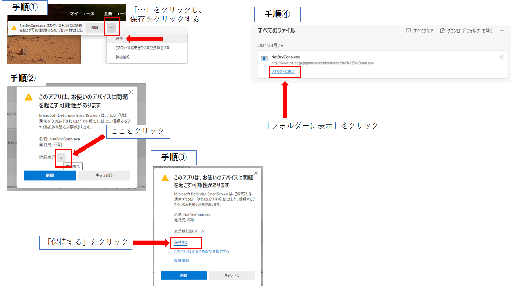

# 大阪工業大学 ノートPCサポートサイト: Windows用

### Windows用の設定動画集です（2021年用）
<!--
スマートフォンやタブレットを使用してこのサイトを見るには、下のQRコードを読み取って下さい。（トップページに飛びます）
 

 
また、短縮URL **http://is.gd/oitpc** でもアクセスできます。
 
-->
## 目次
### Windows PC
- [Windowsの基本操作：PCに不慣れな人はこの動画をまず見ておきましょう。](#winbasic)
- [Surface, Surface Laptop, Surface Book用キーボード設定](#surface)
- [Windows用 Officeインストール動画](#winoffice)
- [Adobe Readerのインストール](#winadobe)
- [VPN接続ツールのインストールと設定](#winvpn)
- [ネットワークドライブ（教材フォルダ）接続ツールのインストール](#windrive)
- [教材フォルダからのファイル取得（ダウンロード）方法](#windownload)
- [教材フォルダへのファイル提出（アップロード）方法](#winupload)
- [大学プリンタのインストール・設定方法](#winprinter)

- [お問い合わせ](#contact)

---

### **Windowsの基本操作：PCに不慣れな人はこの動画をまず見ておきましょう。**
<iframe width="560" height="315" src="https://www.youtube.com/embed/WkTJBk9QWws" title="YouTube video player" frameborder="0" allow="accelerometer; autoplay; clipboard-write; encrypted-media; gyroscope; picture-in-picture" allowfullscreen></iframe>
 

### **Surface, Surface Laptop, Surface Book用キーボード設定**
※Microsoft Surfaceシリーズを購入した人は、必ずこの設定を行って下さい。他メーカのPCを購入した人は不要です。 
<iframe width="560" height="315" src="https://www.youtube.com/embed/4Xmogjmm0IU" title="YouTube video player" frameborder="0" allow="accelerometer; autoplay; clipboard-write; encrypted-media; gyroscope; picture-in-picture" allowfullscreen></iframe>
 
 

### **Windows用 Officeインストール動画**
<iframe width="560" height="315" src="https://www.youtube.com/embed/Q3MivoKECk4" title="YouTube video player" frameborder="0" allow="accelerometer; autoplay; clipboard-write; encrypted-media; gyroscope; picture-in-picture" allowfullscreen></iframe>

 

### **Adobe Readerのインストール**
<iframe width="560" height="315" src="https://www.youtube.com/embed/k-p0ilDfL3o" title="YouTube video player" frameborder="0" allow="accelerometer; autoplay; clipboard-write; encrypted-media; gyroscope; picture-in-picture" allowfullscreen></iframe>
 
 

### **VPN接続ツールのインストールと設定**
 
**注意：VPNツールのインストール時には、かなり下の方にある「FortiClient VPN」をダウンロードしてください。**
 
 

   
  <iframe width="560" height="315" src="https://www.youtube.com/embed/K3YwWlWieGI" title="YouTube video player" frameborder="0" allow="accelerometer; autoplay; clipboard-write; encrypted-media; gyroscope; picture-in-picture" allowfullscreen></iframe>
 

### **ネットワークドライブ（教材フォルダ）接続ツールのインストール**
<iframe width="560" height="315" src="https://www.youtube.com/embed/oFUTSmyQUxs" title="YouTube video player" frameborder="0" allow="accelerometer; autoplay; clipboard-write; encrypted-media; gyroscope; picture-in-picture" allowfullscreen></iframe>
 
アクセス先: [http://s.oit.ac.jp/dw](http://s.oit.ac.jp/dw) <strong>学外からはVPN接続が必要</strong>
 
 
<strong>※「NetDrvConn.exeはお使いのデバイスに問題を起こす可能性があるため、ブロックされました。」</strong>とエラーが出る場合は、この場合は、次の手段に従ってください。そうすると、ダウンロードされ補助資料にあるように、フォルダに表示されます。（動画内でも説明済みです）
 
 

 
 
また、動画3:06あたりから説明していますが「WindowsによってPCが保護されました」と出た場合は、「詳細情報」をクリックし、次に「実行」をクリックしてください。1度実施すればこの画面は再度は出てきません。
 
 

 
 

### **教材フォルダからのファイル取得（ダウンロード）方法**
<iframe width="560" height="315" src="https://www.youtube.com/embed/_aFL-sVxyKA" title="YouTube video player" frameborder="0" allow="accelerometer; autoplay; clipboard-write; encrypted-media; gyroscope; picture-in-picture" allowfullscreen></iframe>

 

### **教材フォルダへのファイル提出（アップロード）方法**
<iframe width="560" height="315" src="https://www.youtube.com/embed/fa3exZ9HnT0" title="YouTube video player" frameborder="0" allow="accelerometer; autoplay; clipboard-write; encrypted-media; gyroscope; picture-in-picture" allowfullscreen></iframe>
 

### **大学プリンタのインストール・設定方法**
 
プリンタを参照するアドレスは、次の通りです。この動画では、大宮キャンパスを例に説明しています。 
 
大宮キャンパス：<strong>\\\\o-prspl01.ad.oit.ac.jp</strong> 
 
梅田キャンパス：<strong>\\\\u-prspl01.ad.oit.ac.jp</strong> 
 
枚方キャンパス：<strong>\\\\h-prspl01.ad.oit.ac.jp</strong> 
 
（画面上では \\\\ になっていますが、そのままコピペするとWindows上では￥マークになります） 
 
また、プリンタ機種もキャンパスによって異なります。大宮キャンパスと枚方キャンパスはこの動画例のようにC3375ですが、梅田キャンパスはApeosPort V C3376, ApeosPort V C2276になります。 
 
<strong>※この動画内の7:40から15秒程度が真っ暗になっていますが、実際にこの手順で実行すると「このアプリがデバイスに変更を加えることを許可しますか」という表示が出ます。この時には「はい」を選択して下さい。</strong> 
 
<iframe width="560" height="315" src="https://www.youtube.com/embed/YBA7cqKn8tY" title="YouTube video player" frameborder="0" allow="accelerometer; autoplay; clipboard-write; encrypted-media; gyroscope; picture-in-picture" allowfullscreen></iframe>

 
---

### お問い合わせ

各キャンパスの情報センター窓口まで
 
 
[Back](index.html)
